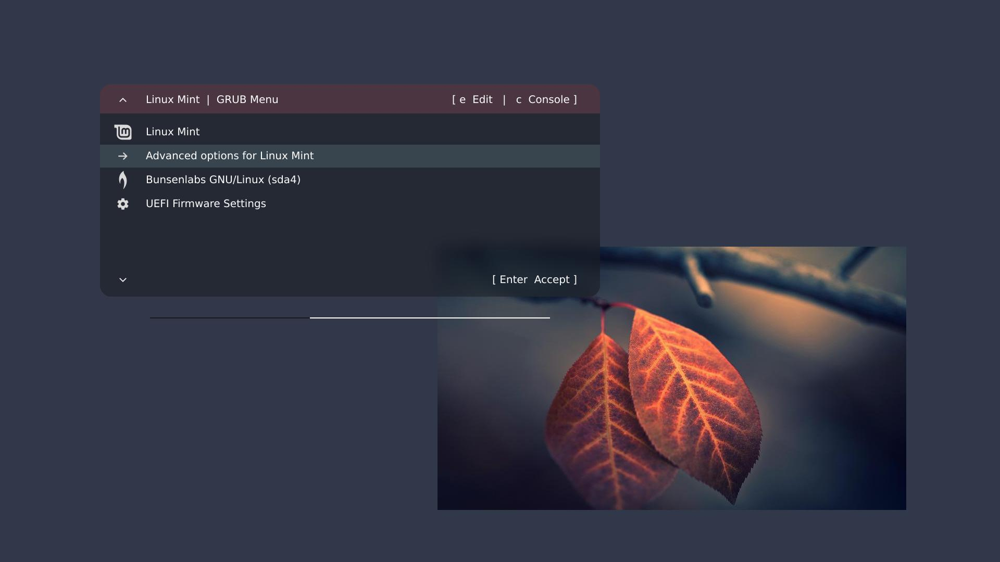
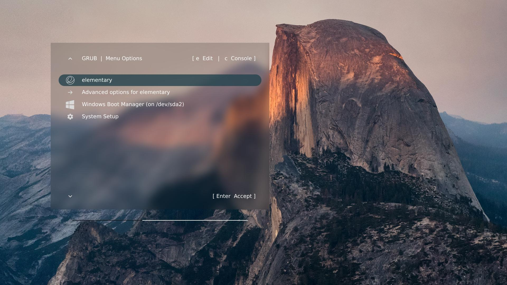
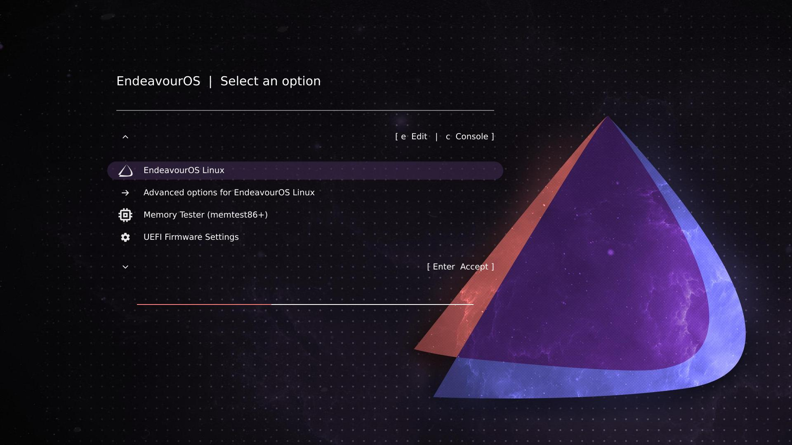

# Grub EvoDevo

Grub EvoDevo is a configurable GRUB theme with scalable graphics, background blurring,
and antialiased true-type fonts. Any wallpaper can be used as theme background.

The style of the EvoDevo menu can be _narrow_, _wide_, or _maximal_. As shown in the
following screenshots, menu styles differ in terms of header colorization, margins,
border types, and formatting of the menu title.







In all cases, the install script detects your GRUB menu entries and assigns distro
emblems/icons to them automatically. If a distro is not recognized, it is assigned
a hashbang (#) as emblem.


# Won't, don't

- EvoDevo **will not install on Fedora**, or more generally, any distribution
that relies on `grub2-mkconfig` (instead of `grub-mkconfig`) for GRUB updates.

- If your booting process involves a
[Unified Kernel Image](https://wiki.gentoo.org/wiki/Unified_kernel_image) (UKI),
then EvoDevo's GRUB menu, although fully functional, will look **partially or
totally empty**.

TLDR: Do not install EvoDevo on a system with UKI.


# Dependencies

Aside from a functional POSIX system, EvoDevo requires:

- **ImageMagick** or **GraphicsMagick** to resize, crop, and blur your chosen
wallpaper.

- **rsvg-convert** or **Inkscape** to convert SVG documents to PNG images.

The rsvg-convert utility is less known, but more lightweight, than Inkscape. If
you choose to install `rsvg-convert`, look for a package named along the lines
of `librsvg` or `librsvg2`.


# Installation

- **Create a directory** (say, "evodevo") somewhere on your computer.

- Scroll back to the top of this page and have a look at the file tree.  One of
the files is a zip archive called, **evodevo.zip**. Right-click on this file to
open a context menu, and choose the "**Open Link in New Tab**" option. GitHub
will allow you to download the archive by clicking on the **Raw** button or
the associated download icon.

- Once evodevo.zip saved on your computer, put it in the directory you just created,
and **unpack the archive** with `unzip evodevo.zip`. This will provide you with two
shell scripts, `install.sh` and `uninstall.sh`, and two subdirectories, `data/` and
`wallpapers/`.

- Also make sure that the install and uninstall scripts are executable (`chmod u+x
 install.sh uninstall.sh`).

## Note

The `data/` subdirectory contains the SVG data needed to draw distro emblems. The
`wallpapers/` subdirectory contains the default wallpaper.


# Basic configuration

To configure the install script, you will need to know the width and height
of your screen in pixels **at boot time**. These values must be those used by
GRUB before your graphic driver is loaded, so **do not try to read them from
your desktop environment**.

Instead, **reboot your computer**, and type `c` when the GRUB menu shows up. This
will open a command line with a prompt (`>`). Type `videoinfo` [Enter], and GRUB
will print a list of screen resolutions. The one used at boot time **is prefixed
by an asterisk** (*). For example, with this list:

```
  0x000  320 x  200 x 32 (1280)  Direct color, mask: 8/8/8/8  pos: 16/8/0/24
  0x006  320 x  240 x 32 (1280)  Direct color, mask: 8/8/8/8  pos: 16/8/0/24
  0x007  320 x  200 x 32 (2560)  Direct color, mask: 8/8/8/8  pos: 16/8/0/24
* 0x008 1600 x 1200 x 32 (6400)  Direct color, mask: 8/8/8/8  pos: 16/8/0/24
  0x009 1280 x  800 x 32 (5120)  Direct color, mask: 8/8/8/8  pos: 16/8/0/24
```

boot-time resolution is 1600 x 1200 pixels. Whatever this resolution is, take
note of it.

Then, once logged in your system, open `install.sh` in your favorite text
editor. Configuring EvoDevo involves a series of `VARIABLE=VALUE` assignments.
They appear at the start of the install script, in the section titled:

```
# ------------------------------------------------------------
# CONFIGURATION
# ------------------------------------------------------------
```

Each assignment has a default value and is followed by comments (`# ...`)
designed to help you during the configuration process.

The first two assignments, to `ScreenWidth` and `ScreenHeight`, are the most
important ones. **Replace the default values by the values GRUB uses at boot
time** (and that you have just determined).

The third assignment, about `FontSize` in pixels, is important too, as
**everything in the theme is scaled as function of font size**. The default
value, 20, will work well with a screen height of about 1000 pixels. With a
larger screen height (e.g., 2000 pixels), try a larger font size (e.g., 40).

The fourth assignment sets the **background wallpaper**. If you leave this
line as is:

```
Wallpaper='default.jpg'
```

EvoDevo will use the default wallpaper—a picture of the ocean by Magda Ehlers.

If you want to use a custom picture as wallpaper, however, you will need to
**add your picture file** to the `wallpapers/` subdirectory of the install folder,
and you will need to replace `default.jpg` in the install script by the actual
name of your file. For example:

```
Wallpaper='my picture.jpg'
```

## Note

Your wallpaper file must be a valid JPG or PNG picture, in 8-bit or 16-bit RGB
color mode without interlacing.

The width and height of your wallpaper should not necessarily equal those of the
screen at boot time, as the install script will automatically resize your picture
to the correct dimensions. To avoid possible distortions, however, your wallpaper
aspect ratio should preferably match that of the boot-time screen.


# First check

Once done with the `ScreenWidth`, `ScreenHeight`, `FontSize`, and `Wallpaper`
assignments, **save the install script and run it as root**:

```
sudo ./install.sh
```

If everything goes well, the script will conclude with the following
message:

```
-----------------------------
Theme installed successfully!
-----------------------------
You can now reboot your computer to see what the theme looks like.
Alternatively, if instead of rebooting you just want to preview
the results, you can use any image viewer to open:

/usr/share/grub/themes/evodevo/panel-back.png
/usr/share/grub/themes/evodevo/panel-front.png

and

/usr/share/grub/themes/evodevo/icons/*png
```

If you do **not** see this message, then something went wrong (and the script will
probably tell you what). A dependency may be missing, for example. The worst kind
of error would be to forget to quote a `VALUE WITH BLANKS IN IT` or to forget a
closing quote (as this would wreak havoc on the whole shell script).

Once you are satisfied with your configuration, **reboot your computer to have
the EvoDevo GRUB theme show up**.


# Advanced configuration

There are **25 theme parameters** besides `ScreenWidth`, `ScreenHeight`, `FontSize`,
and `Wallpaper`. Their usage is explained in the comments after each assignment
line.

These parameters are ordered in terms of decreasing importance, so change them
starting from the top, and only if the need arises.


# Theme maintenance

GRUB does not do font antialiasing natively, so EvoDevo uses a workaround to
achieve non-pixelated menu entries. For each entry in your `grub.cfg` file, the
install script builds a corresponding **fake entry**—a PNG picture that GRUB
will display as an icon on the left side of the menu. The real entries are still
present on the right, however, so EvoDevo masks them with a PNG image split from
the background wallpaper.

Also, EvoDevo adds custom classes (`--class menuitem1`, `--class menuitem2`,
...) to the menu entries in `grub.cfg`. These classes are used to fetch the
PNG pictures of the fake menu entries.

Unfortunately, whenever your system overwrites `grub.cfg` (this will happen on
any GRUB or kernel update, for example), the custom classes are wiped out and
**the fake entries will not show up on the next reboot**:


This may look scary, but the real entries, although hidden, are still there and
GRUB remains fully functional. Pressing the arrow keys, for example, will still
move the focus up and down.

So you can just wait for your default entry to boot. After booting, you will
be able to restore EvoDevo by running `sudo ./install`.

TLDR: **Whenever your distribution updates GRUB**, run `sudo ./install.sh`
to **restore the theme**.

Do check carefully, however, for the possibility of breaking changes in
GRUB. Your distribution should keep you informed about these.

The theme can be uninstalled at any time by running `sudo ./uninstall.sh`.


# Troubleshooting / FAQ

- **Q**: I am positive **Inkscape is installed**, yet `./install.sh` aborts with
this error message: "`neither rsvg-convert nor Inkscape was detected.`"

- **A**: Your software center may have installed Inkscape with Flatpak or Snap.
Try to uninstall Inkscape, then reinstall it directly via your system package
manager (e.g., `apt` or `pacman`).

- **Q**: When running `install.sh`, I see some messages about a **"deprecated
convert command"**.

- **A**: These messages are warnings from ImageMagick. They are not errors,
however, and they do not impede installation.

- **Q**: I am positive EvoDevo is installed. Yet, **nothing shows up on
reboot**—only the GRUB console.

- **A**: Some distributions hide the GRUB menu by writing the following in
`/etc/default/grub`:

```
GRUB_TIMEOUT_STYLE=hidden
GRUB_TIMEOUT=0
```

To be able to see the themed GRUB menu on reboot, you'll need to edit
`/etc/default/grub` as root (e.g., with `sudo nano`) and change these lines to:

```
GRUB_TIMEOUT_STYLE=menu
GRUB_TIMEOUT=15
```

(The value of 15 seconds is just an example, the idea is to leave enough time
for the non-hidden menu to show up.)

Then reinstall EvoDevo (`sudo ./install.sh`) before rebooting.

- **Q**: I have installed EvoDevo with my custom wallpaper, but the theme does
not load, and instead **another background picture shows up**.

- **A**: This picture is probably a residue of another GRUB customization, left
under the `/boot/grub/` directory. Have a look at what `/boot/grub/` contains. If
some JPG or PNG file is listed under this directory, move the file out of the way,
or it will interfere with theme installation.

- **Q**: I have checked that **my wallpaper is a valid 8-bit or 16-bit JPG or PNG**
picture, yet GRUB still complains about "png bits" or "png color range" errors.

- **A**: In a few cases, GRUB may not decode a wallpaper picture correctly. This
is more likely to occur if your wallpaper has a restricted RGB profile with
only a few colors in it. Try to increase the color range by adding smooth gradients
to your picture. If everything fails, you may have no other choice than trying
another wallpaper—preferably a photograph with a rich variety of colors.

- **Q**: I have installed EvoDevo, but the menu looks slightly ugly, and I see
**some faded text on the right of the screen**.

- **A**: Your wallpaper is not 100% opaque. Open it in Gimp (or any other
similar software) to remove the alpha channel (i.e., transparency).

- **Q**: The themed menu looks fine, but everywhere my distro should appear,
**another distro** appears instead!

- **A**: Some distros (e.g., Linux Mint) have their name replaced by the name
of a parent distro (e.g., Ubuntu) in the GRUB config file. To fix the problem,
look for a line that says:

```
Repair=
```

in the EvoDevo install script. As explained in the comments below this line,
assigning a value to `Repair` allows you to get rid of the parent name and
restore your distro name in its correct form. In the case of Linux Mint
showing up as "Ubuntu," for example, writing:

```
Repair='Ubuntu@Linux Mint'
```

in `install.sh` will do what you want.

- **Q**: I have installed EvoDevo, but the **menu looks empty**.

- **A**: Your system may have completed an automatic update after you installed
the theme, but before rebooting. Try to reinstall EvoDevo, then reboot yet another
time. If the error persists, check whether your system uses UKI (Unified Kernel
Image) for booting. If you do no use any UKI, please open an
[issue](https://github.com/ftonneau/grub-evodevo/issues).


# Link

Further examples of Grub EvoDevo customization can be found on
[OpenDesktop](https://www.gnome-look.org/p/2366327).


# Credits

The default wallpaper is a picture by Magda Ehlers, downloaded from
[pexels](https://www.pexels.com/) on July 12, 2026.

The emblems for Bodhi Linux, OpenSUSE, Parrot OS, Spaced Linux, and Vanilla
OS were downloaded from the corresponding distribution/OS web sites.

The emblems for Apple, Arch, Debian, Fedora, Gentoo, Mint, Ubuntu, Windows,
as well as the camera, cog, memory, and power emblems, were downloaded from
[pictogrammers](https://pictogrammers.com/library/mdi/).

All of the other emblems were downloaded from Wikimedia Commons or custom made.

Emblems were simplified whenever needed to accommodate a reduced display size.


# Thanks

Special thanks to [Loric Brevet](https://github.com/lobre),
[Rubben Christiano](https://github.com/BakaBen),
Erik Koennecke,
[Logansfury](https://github.com/Logansfury),
[Matt Marcuzzo](https://github.com/MattM123),
and David Niklas for their advice or help in testing the theme.


# License

MIT

